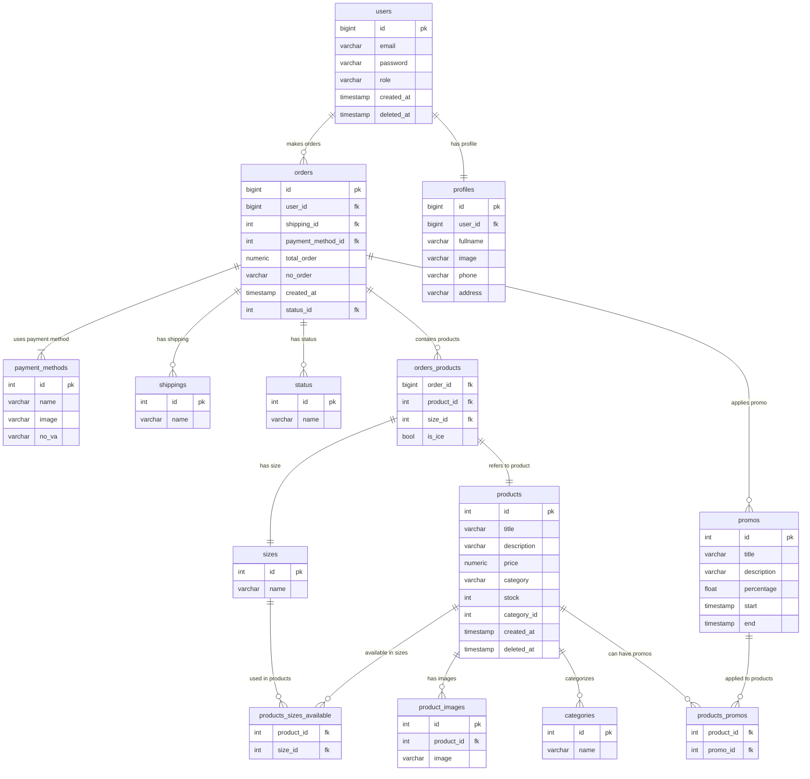

# ERD for COFFEE SHOP

```mermaid
erDiagram 
    users {
        bigint id pk
        varchar email 
        varchar password
        varchar role
        timestamp created_at
        timestamp deleted_at
    }

    payment_methods { 
        int id pk
        varchar name
        varchar image
        varchar no_va
    }

    products {
        int id pk
        varchar title
        varchar description
        numeric price
        varchar category 
        int stock
        int category_id
        timestamp created_at
        timestamp deleted_at
    }

    shippings {
        int id pk
        varchar name
    }

    categories{
        int id pk
        varchar name
    }

    products_sizes_available {
        int product_id fk
        int size_id fk
    }

    sizes {
        int id pk
        varchar name
    }
    orders {
        bigint id pk
        bigint user_id fk
        int shipping_id fk
        int payment_method_id fk
        numeric total_order
        varchar no_order
        timestamp created_at
        int status_id fk
    }

    profiles {
        bigint id pk
        bigint user_id fk
        varchar fullname
        varchar image
        varchar phone
        varchar address
    }

    status {
        int id pk
        varchar name
    }

    product_images {
        int id pk
        int product_id fk
        varchar image
    }


    orders_products {
        bigint order_id fk
        int product_id fk
        int size_id fk
        bool is_ice
    }

    products_promos {
        int product_id fk
        int promo_id fk
    }


    promos {
        int id pk
        varchar title
        varchar description
        float percentage
        timestamp start
        timestamp end 
    }


    users ||--|| profiles : "has profile"
    users ||--o{ orders : "makes orders"

    orders ||--|{ payment_methods : "uses payment method"
    orders ||--o{ orders_products : "contains products"
    orders ||--o{ shippings : "has shipping"
    orders ||--o{ status : "has status"
    orders ||--o{ promos : "applies promo"

    orders_products ||--|| sizes : "has size"
    orders_products ||--|| products : "refers to product"


    promos ||--o{ products_promos : "applied to products"
    products ||--o{ products_sizes_available : "available in sizes"
    products ||--o{ product_images : "has images"
    products ||--o{ products_promos : "can have promos"
    products ||--o{ categories : "categorizes"

    sizes ||--o{ products_sizes_available : "used in products"


```