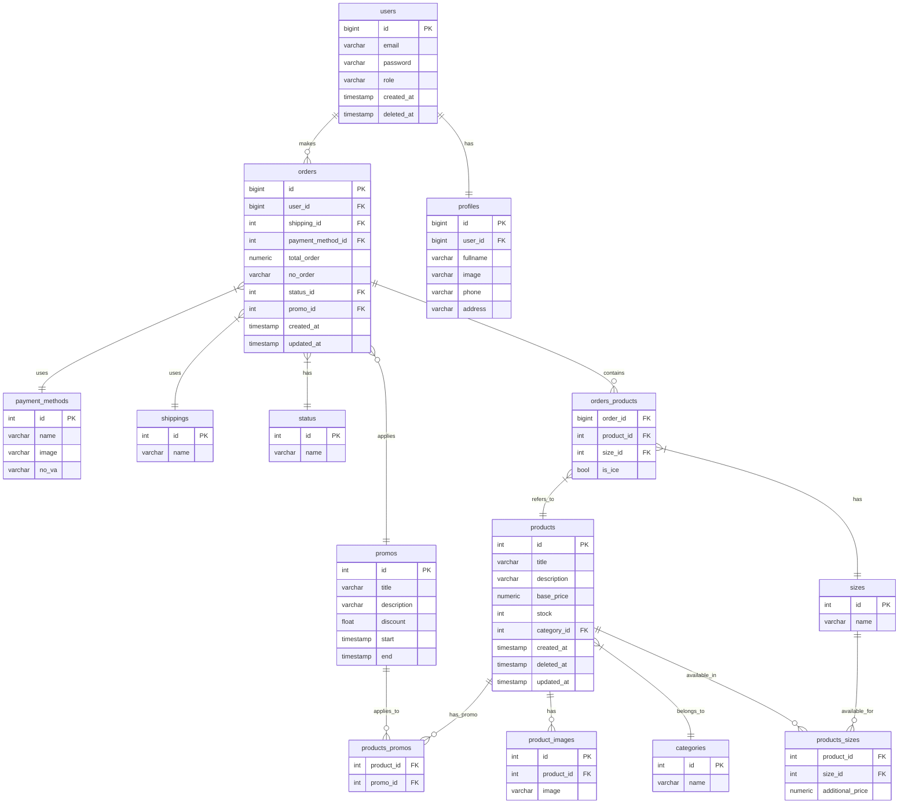

# ERD for COFFEE SHOP

```mermaid
erDiagram
    users {
        bigint id PK
        varchar email 
        varchar password
        varchar role
        timestamp created_at
        timestamp deleted_at
    }

    payment_methods {
        int     id      PK
        varchar name
        varchar image
        varchar no_va
    }

    products {
        int id PK
        varchar title
        varchar description
        numeric base_price
        int stock
        int category_id FK
        timestamp created_at
        timestamp deleted_at
        timestamp updated_at
    }

    shippings {
        int id PK
        varchar name
    }

    categories {
        int id PK
        varchar name
    }

    products_sizes {
        int product_id FK
        int size_id FK
        numeric additional_price
    }

    sizes {
        int id PK
        varchar name
    }

    orders {
        bigint id PK
        bigint user_id FK
        int shipping_id FK
        int payment_method_id FK
        numeric total_order
        varchar no_order
        int status_id FK
        int promo_id FK
        timestamp created_at
        timestamp updated_at
    }

    profiles {
        bigint id PK
        bigint user_id FK
        varchar fullname
        varchar image
        varchar phone
        varchar address
    }

    status {
        int id PK
        varchar name
    }

    product_images {
        int id PK
        int product_id FK
        varchar image
    }

    orders_products {
        bigint order_id FK
        int product_id FK
        int size_id FK
        bool is_ice
    }

    products_promos {
        int product_id FK
        int promo_id FK
    }

    promos {
        int id PK
        varchar title
        varchar description
        float discount
        timestamp start
        timestamp end
    }

    users ||--|| profiles : "has"
    users ||--o{ orders : "makes"
    
    orders }|--|| payment_methods : "uses"
    orders }|--|| shippings : "uses"           
    orders ||--o{ orders_products : "contains"
    orders }|--|| status : "has"
    
    orders_products }|--|| products : "refers_to"
    
    promos ||--o{ products_promos : "applies_to"
    products ||--o{ products_promos : "has_promo"
    products ||--o{ product_images : "has"
    products }|--|| categories : "belongs_to"
    
    products ||--o{ products_sizes : "available_in"
    sizes ||--o{ products_sizes : "available_for"
    orders_products }|--|| sizes : "has"
    
    orders }o--|| promos : "applies"
```