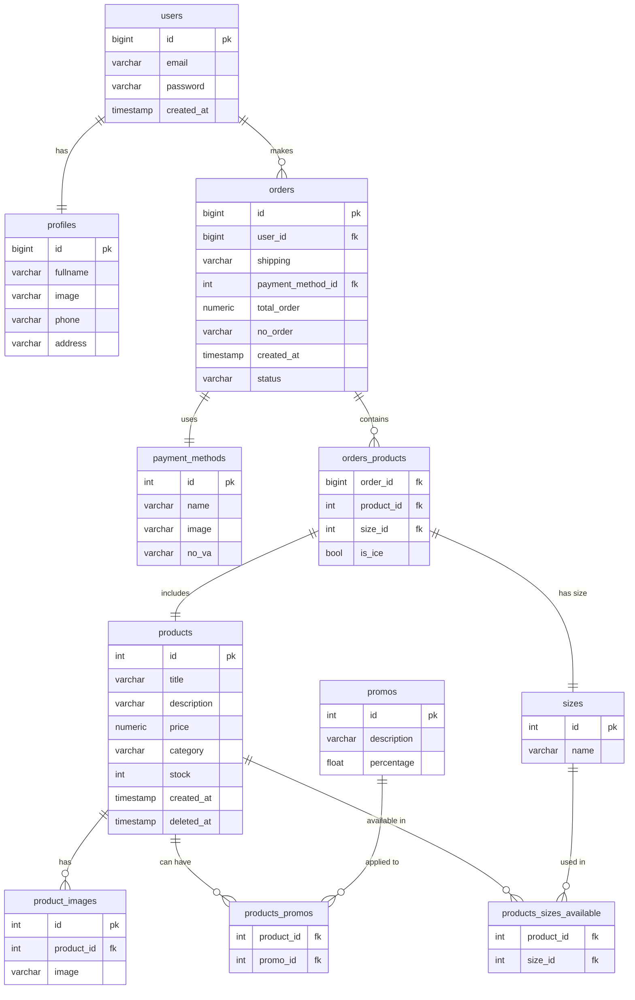

# ERD for COFFEE SHOP

```mermaid
erDiagram

    users {
        bigint id pk
        varchar email
        varchar password
        timestamp created_at
    }

    profiles {
        bigint id pk
        varchar fullname
        varchar image
        varchar phone
        varchar address
    }

    payment_methods {
        int id pk
        varchar name
        varchar image
        varchar no_va
    }

    sizes {
        int id pk
        varchar name
    }

    products {
        int id pk
        varchar title
        varchar description
        numeric price
        varchar category
        int stock
        timestamp created_at
        timestamp deleted_at
    }

    product_images {
        int id pk
        int product_id fk
        varchar image
    }

    products_sizes_available {
        int product_id fk
        int size_id fk
    }

    orders {
        bigint id pk
        bigint user_id fk
        varchar shipping
        int payment_method_id fk
        numeric total_order
        varchar no_order
        timestamp created_at
        varchar status
    }

    orders_products {
        bigint order_id fk
        int product_id fk
        int size_id fk
        bool is_ice
    }

    products_promos {
        int product_id fk
        int promo_id fk
    }

    promos {
        int id pk
        varchar description
        float percentage
    }

    users ||--|| profiles : "has"
    users ||--o{ orders : "makes"
    orders ||--|| payment_methods : "uses"

    orders ||--o{ orders_products : "contains"
    orders_products ||--|| products : "includes"
    orders_products ||--|| sizes : "has size"

    products ||--o{ product_images : "has"
    products ||--o{ products_promos : "can have"
    products ||--o{ products_sizes_available : "available in"

    promos ||--o{ products_promos : "applied to"
    sizes ||--o{ products_sizes_available : "used in"


```